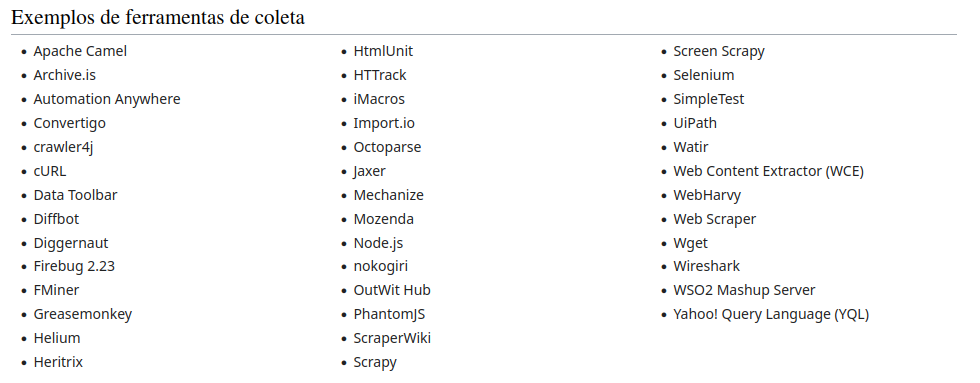

In this repository is about Web Scraping for analyze of datas

Objetivos Gerais:

A indexação web é usada para ajudar a tornar os motores de busca mais eficientes; já a web scraping pode ser usada por diferentes razões, tais como comparação de preços online, monitoramento meteorológico, pesquisas de mercado, coleta de dados governamentais, monitoramento de dados e, em alguns casos, roubo de informação.

Motivações:

- O comércio eletrônico usa a web scraping para monitorar os preços de empresas concorrentes;
- Advogados a utilizam para ver relatórios de julgamentos passados, para referências futuras;
- Recrutadores a utilizam para coletar perfis de pessoas;
- Empresas de mídia a utilizam para avaliar conteúdos e coletar informações referentes a trend topics e hashtags;
- Jornalistas a utilizam para coletar informações sobre acontecimentos e assim facilitar a elaboração de reportagens;

